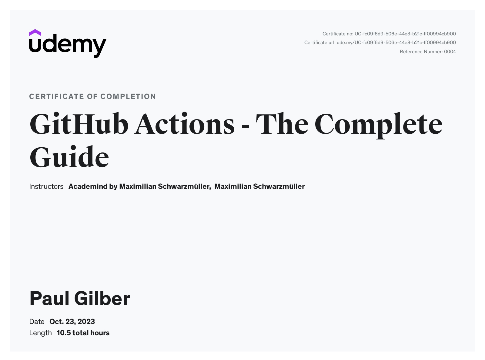

# github-actions
Repository for learning GitHub Actions

## Features
- CI/CD Automation
- Code & Repository Management

## Structure
```sh
repository
├── worflow1
│   ├── job1
│   │   ├── step1
│   │   └── step2
│   └── job2
│       └── step1
├── worflow2
│   └── job1
│       ├── step1
│       ├── step2
│       ├── step3
│       └── step4
└── worflow3
    ├── job1
    │   └── step1
    └── job2
        └── step1
```

## Key Components
### Workflows
- Attached to a `GitHub repository`
- Contain one or more `Jobs`
- Triggered upon `Events`

### Jobs
- Define a `Runner` (execution environment)
- Contain one or more `Steps`
- Can run in parallel(default) or sequential
- Can be conditional

### Steps
- Execute a `shell script` or an `Action`
- Can use custom or third-party actions
- Are executed in order
- Can be conditional

## Events (Workflow Triggers)
1. Repository-related
- push
- fork
- watch
- pull_request
- issues
- discussion
- create
- issue_comment
2. Other
- workflow_dispatch
- repository_dispatch
- schedule
- workflow_call

## Security and Permissions
### Security Concerns
#### Script Injection
```
A value, set outside a Workflow, is used in a Workflow
Example(s):
    - Issue title used in a Workflow shell command
        -- Workflow / command behavior could be changed
```

#### Malicious Third-Party Actions
```
Actions can perform any logic, including potentially malicious logic
Example(s):
    - A third-party Action that reads and exports your secrets
Solution(s):
    - Only use trusted Actions and inspect code of unknown / untrusted authors
```

#### Permission Issues
```
Avoid overly permissive permissions (Least Privilege Principle)
Example(s):
    - Only allow checking out code ("read-only")
Solution(s):
    - GitHub Actions supports fine-grained permissions control
```

## References
- [GitHub Actions Billing](https://docs.github.com/en/billing/managing-billing-for-github-actions/about-billing-for-github-actions)
- [Managing GitHub Actions settings for a repository](https://docs.github.com/en/repositories/managing-your-repositorys-settings-and-features/enabling-features-for-your-repository/managing-github-actions-settings-for-a-repository)
- [About GitHub-hosted runners](https://docs.github.com/en/actions/using-github-hosted-runners/about-github-hosted-runners/about-github-hosted-runners)
- [Workflow Syntax](https://docs.github.com/en/actions/using-workflows/workflow-syntax-for-github-actions#onpull_requestpull_request_targetbranchesbranches-ignore)
- [Events that trigger workflows](https://docs.github.com/en/actions/using-workflows/events-that-trigger-workflows)
- [GitHub Action Marketplace](https://github.com/marketplace?type=actions)
- [Contexts](https://docs.github.com/en/actions/learn-github-actions/contexts)
- [Expressions](https://docs.github.com/en/actions/learn-github-actions/expressions)
- [Skipping workflow runs](https://docs.github.com/en/actions/managing-workflow-runs/skipping-workflow-runs)
- [Defining outputs for jobs](https://docs.github.com/en/actions/using-jobs/defining-outputs-for-jobs)
- [Caching dependencies to speed up workflows](https://docs.github.com/en/actions/using-workflows/caching-dependencies-to-speed-up-workflows)
- [Default environment variables](https://docs.github.com/en/actions/learn-github-actions/variables#default-environment-variables)
- [Using conditions to control job/step execution](https://docs.github.com/en/actions/using-jobs/using-conditions-to-control-job-execution)
- [Using a matrix for your jobs](https://docs.github.com/en/actions/using-jobs/using-a-matrix-for-your-jobs)
- [Running jobs in a container](https://docs.github.com/en/actions/using-jobs/running-jobs-in-a-container)
- [About service containers](https://docs.github.com/en/actions/using-containerized-services/about-service-containers)
- [Publishing an action](https://docs.github.com/en/actions/creating-actions/publishing-actions-in-github-marketplace#publishing-an-action)
- [Assigning permissions to jobs](https://docs.github.com/en/actions/using-jobs/assigning-permissions-to-jobs)
- [Defining access for the GITHUB_TOKEN scopes](https://docs.github.com/en/actions/using-jobs/assigning-permissions-to-jobs#defining-access-for-the-github_token-scopes)
- [About security hardening with OpenID Connect](https://docs.github.com/en/actions/deployment/security-hardening-your-deployments/about-security-hardening-with-openid-connect)
- [Configuring OpenID Connect in Amazon Web Services](https://docs.github.com/en/actions/deployment/security-hardening-your-deployments/configuring-openid-connect-in-amazon-web-services)
- [Permissions for the GITHUB_TOKEN](https://docs.github.com/en/actions/security-guides/automatic-token-authentication#permissions-for-the-github_token)
- [Security hardening for GitHub Actions](https://docs.github.com/en/actions/security-guides/security-hardening-for-github-actions)
- [Using secrets in GitHub Actions](https://docs.github.com/en/actions/security-guides/using-secrets-in-github-actions)
- [Automatic token authentication](https://docs.github.com/en/actions/security-guides/automatic-token-authentication)
- [Keeping your GitHub Actions and workflows secure Part 1: Preventing pwn requests](https://securitylab.github.com/research/github-actions-preventing-pwn-requests/)
- [academind/github-actions-course-resources](https://github.com/academind/github-actions-course-resources)

## Courses
### Udemy
- [Learn how to build automated CI / CD workflows with GitHub's DevOps service.](https://www.udemy.com/course/github-actions-the-complete-guide/)

